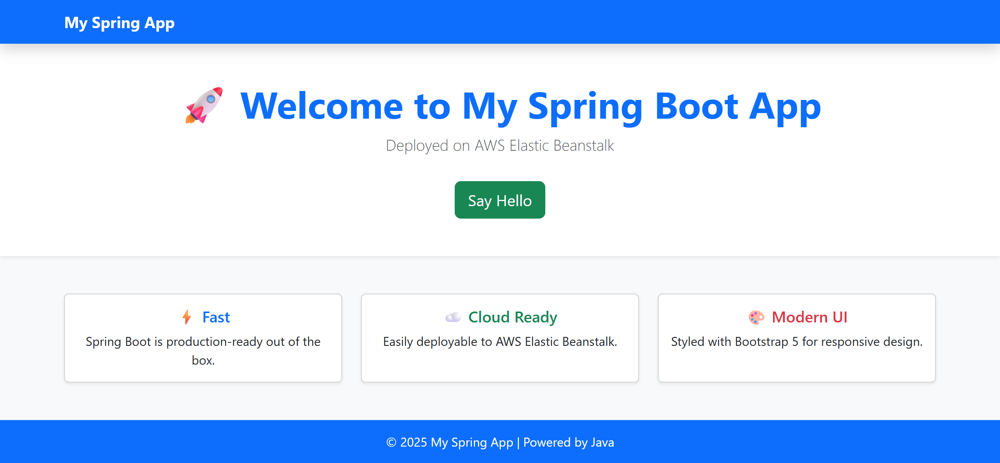

---

# 🚀 Java Spring Boot App on AWS Elastic Beanstalk

## 📌 Project Overview

This project demonstrates deploying a **Spring Boot web application** to **AWS Elastic Beanstalk**.
It covers the full workflow:

* Writing a simple Spring Boot web app with Thymeleaf UI
* Versioning with GitHub
* Packaging the app as a deployable JAR
* Uploading to **Amazon S3**
* Deploying to **Elastic Beanstalk**
* Automating deployment using **GitHub Actions (CI/CD)**

---

## 🛠️ Tech Stack

* **Java 21**
* **Spring Boot** (Web + Thymeleaf)
* **Maven** (build tool)
* **Bootstrap 5** (UI styling)
* **AWS Elastic Beanstalk** (application hosting)
* **Amazon S3** (artifact storage)
* **GitHub Actions** (CI/CD automation)

---

## 📂 Project Structure

```
src/main/java/com/example/demo/
 ├─ controller/       # Spring MVC Controllers
 │   └─ HomeController.java
 ├─ DemoApplication.java

src/main/resources/
 ├─ templates/        # Thymeleaf views (UI pages)
 │   ├─ index.html
 │   └─ hello.html
 ├─ static/           # Static resources (CSS, JS, images)
 │   └─ css/style.css
 └─ application.properties

.github/workflows/
 └─ deploy.yml        # GitHub Actions workflow for CI/CD
```

---

## ⚡ Features

✅ Landing page with Bootstrap UI (`/`)
✅ Dynamic "Hello" page (`/hello`)
✅ Packaged and deployed as a `.jar`
✅ Hosted on **AWS Elastic Beanstalk**
✅ Automated build & deploy pipeline using GitHub Actions

---

## 🚀 Deployment Steps

### 1️⃣ Build the App

```bash
mvn clean package
```

Produces: `target/demo-0.0.1-SNAPSHOT.jar`

---

### 2️⃣ Create Procfile (for Beanstalk)

```
web: java -jar demo-0.0.1-SNAPSHOT.jar --server.port=5000
```

---

### 3️⃣ Upload to S3 & Deploy

* Zip the JAR + `Procfile` → `app.zip`
* Upload to an S3 bucket
* Deploy to Elastic Beanstalk via console or AWS CLI

---

### 4️⃣ Automate with GitHub Actions

Workflow file: `.github/workflows/deploy.yml`

It does the following automatically on push to `main`:

* Builds the app with Maven
* Creates a source bundle (`app.zip`)
* Uploads to S3
* Deploys to Elastic Beanstalk environment

---

## 🌐 Live Application

🔗 **Beanstalk URL:**
[http://wk3-beanstalk-app-env.eba-f3amjfrj.eu-central-1.elasticbeanstalk.com](http://wk3-beanstalk-app-env.eba-f3amjfrj.eu-central-1.elasticbeanstalk.com)

---

## 📦 Repository

🔗 **GitHub Repo:**
[https://github.com/buzrichie/wk3-beans-app](https://github.com/buzrichie/wk3-beans-app)

---

## 📸 Screenshots

### Landing Page



---

## 🏆 Deliverables (as per lab instructions)

* ✅ **Beanstalk Application URL**
* ✅ **GitHub Repository Link**
* ✅ (Optional) **Automated CI/CD Pipeline**

---

## 👨‍💻 Author

**Your Name**
📧 [richmondnyarko123@gmail.com](mailto:richmondnyarko123@gmail.com)

---
